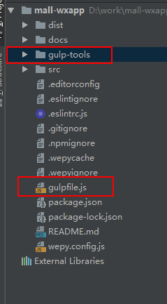

## 使用

* ### 复制文件至wepy项目

    * 将 gulp-tools 文件夹及里面的文件复制到 wepy 项目src同层
    * 将 gulpfile.js 文件复制到 wepy 项目src同层
    * 如下例所示
    
* ### 安装依赖

    * 因为 wepy项目本身有一个 package.json，因不想搞混，把几个包写在了 package-for-gulp-tools.json 中，其实也就三个包
    * npm i -D gulp gulp-watch through2

* ### 打包配置

    * 打开 gulp-tools/packages.config.js 配置主包
    * 例如wepy项目如下:
    
```bash
.
├── README.md
├── package.json
├── src
│   ├── app.wpy                 # 相当于app.json wepy.app
│   ├── components              # 组件 wepy.component
│   │   ├── item.wpy            # 单个商品
│   │   └── search-box.wpy      # 搜索框
│   ├── index.template.html
│   ├── storage                 # 小程序 缓存 使用 情况
│   ├── pages                   # 页面 wepy.page
│   │   ├── home                # 首页
│   │   ├── menu                # 分类
│   │   ├── cart                # 购物车
│   │   ├── mine                # 我的
│   │   ├── fill-order          # 确认下单
│   │   ├── item                # 商品相关
│   │   ├── address             # 收货地址
│   │   ├── success             # 成功页面 (购买成功,发布成功,兑换成功等)
│   │   └── order               # 订单相关
│   └── style
│       ├── color.scss          # 颜色库
│       └── grid.scss           # 公共布局样式
└── wepy.config.js 
```

想将 home && menu 文件夹配为主包，则 gulp-tools/packages.config.js 如下

```javascript
    module.exports = {
        main: { // 主包page文件夹
            'home': true,
            'menu': true // 注意 文件夹不能含有 '-', 否则 当前版本小程序 打包及上传会有错,可改用 '_'
        }
        // 不在主包的文件夹会自动配置为分包
        /**
         * subPackage 的根目录不能是另外一个 subPackage 内的子目录
         * 所以以现在的文件结构，只能以'pages/aaa/'为root 打包
         * */
    }

```

* ### 开启

    * 在 wepy cli 启动后并首次编译完成后，另外新开一个终端 项目目录下`gulp watch`
    * 如只想gulp 处理一次(如 生产版) 可 gulp change-json

 

   
